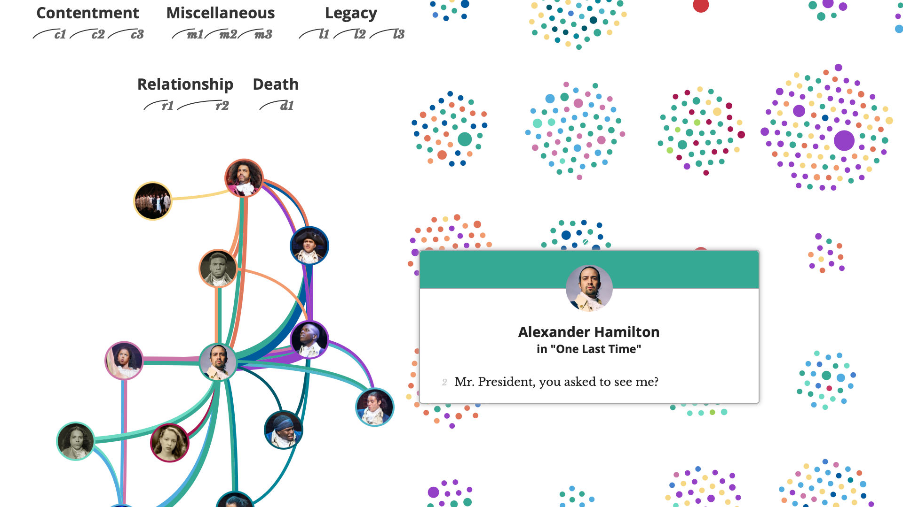
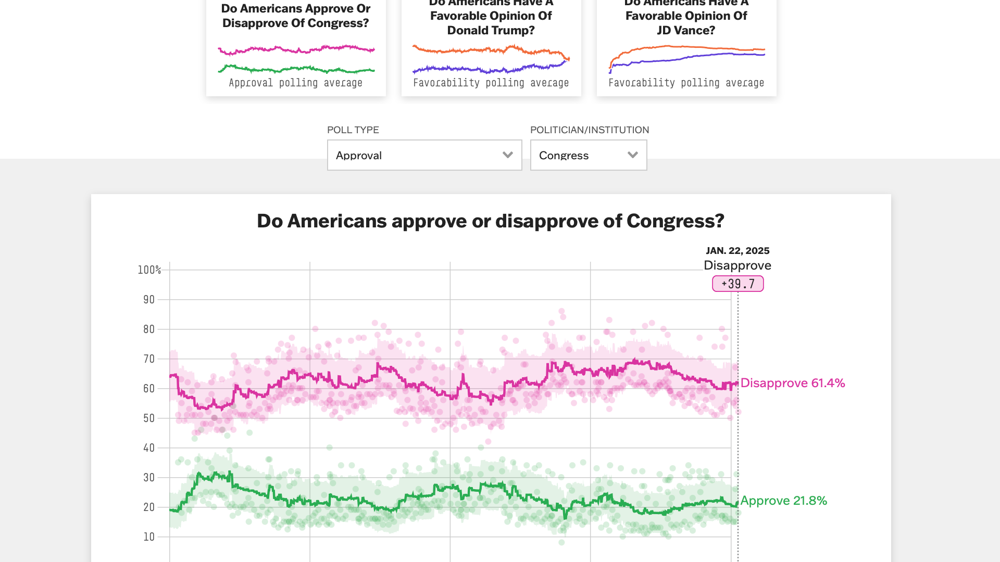
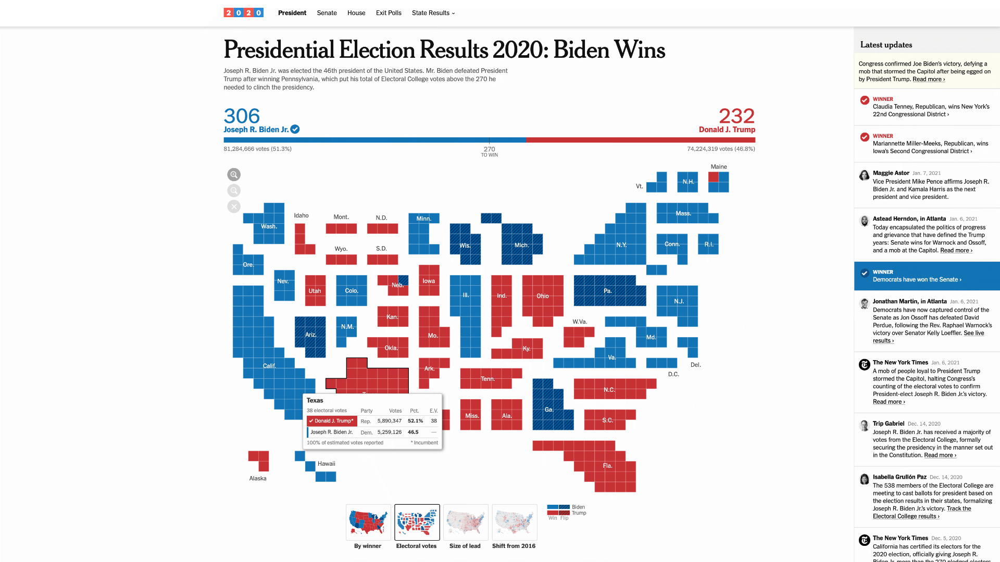
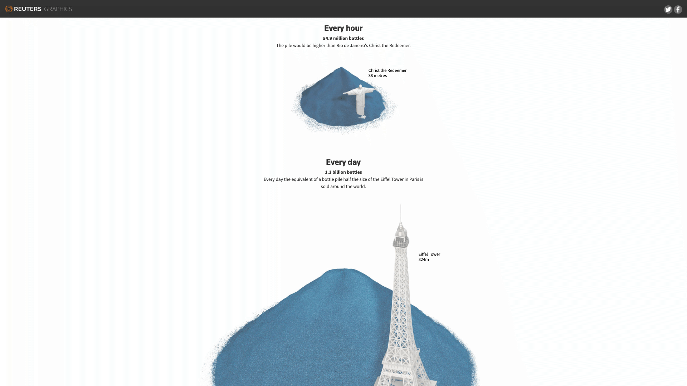
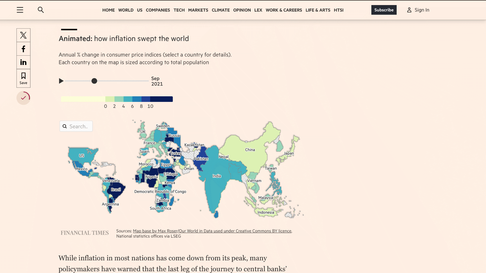

# Data Visualization inspiration from Fun Fun Function
A compiled list of data visualizations inspiration, curated by MPJ and the FFF community. Pull requests welcome!

## Directories and feeds
This particular section doesn't strive to be a comprehensive list of indiviudial visualization, but rather a meta-resource where one can mine around to find interesting examples of how visualization can be done - it is a mix of directories, awards and news outlets.

### [The Pudding](https://pudding.cool)

The Pudding transforms complex data into captivating visual essays that showcase the true potential of web-based data visualization. Their projects span from [AI-powered music criticism](https://pudding.cool/2021/10/judge-my-music/) to [3D population landscapes](https://pudding.cool/2018/10/city_3d/), demonstrating how modern web development can breathe life into data. For a masterclass in interactive storytelling, see their [Hamilton visualization](https://pudding.cool/2017/03/hamilton/) by [Shirley Wu](https://shirleywu.studio), where Broadway meets data art.

### [FiveThirtyEight](https://fivethirtyeight.com)

Founded by [Nate Silver](https://en.wikipedia.org/wiki/Nate_Silver), FiveThirtyEight sets the gold standard for data journalism in the web era. Their visualizations elegantly handle complex datasets, from their signature [election forecasts](https://projects.fivethirtyeight.com/polls/) to [NBA player projections](https://projects.fivethirtyeight.com/2023-nba-player-projections/). Even seemingly simple topics like [ranking Halloween candy](https://projects.fivethirtyeight.com/candy-ranking/) become engaging data stories, demonstrating how web-based visualization can transform any dataset into a compelling narrative.

### [The Upshot](https://www.nytimes.com/international/section/upshot)

The New York Times' data journalism wing represents a masterclass in making complex data intelligible through the web. Known for their [election forecasting visualizations](https://www.nytimes.com/interactive/2020/11/03/us/elections/results-president.html), The Upshot transforms statistical analysis into visual stories that clarify rather than simplify. Their work demonstrates how modern web technologies can turn dense datasets into explorable spaces, making them particularly valuable for developers looking to level up their data presentation skills.

### [Reuters Graphics](https://www.reuters.com/graphics/)

Reuters Graphics exemplifies how data visualization can clarify global events and complex systems. Their work, like [Drowning in Plastic](https://www.reuters.com/graphics/ENVIRONMENT-PLASTIC/0100B275155/) and the [Tokyo Olympics coverage](https://www.reuters.com/graphics/OLYMPICS-2020/EXPLAINER/gjnvwnlwgpw/), demonstrates the power of web-based visualization to bridge the gap between abstract data and human understanding. Each project serves as a case study in transforming dense information into intuitive, explorable interfaces that reveal rather than overwhelm.

### [FlowingData](https://flowingdata.com)

[Nathan Yau](https://en.wikipedia.org/wiki/Nathan_Yau)'s FlowingData stands out as both a learning platform and a source of inspiration for data visualization. Through projects like the [evolution of love songs](https://flowingdata.com/2024/11/13/evolution-of-the-love-song/) and [workforce participation trends](https://flowingdata.com/2014/12/16/increasing-rates-of-men-who-dont-work/), Yau demonstrates how to transform raw data into meaningful narratives. The site serves as a bridge between statistical thinking and visual design, making it an invaluable resource for web developers venturing into data visualization.

### [Financial Times: Visual and Data Journalism](https://www.ft.com/visual-and-data-journalism)

The Financial Times' visual journalism sets the standard for data design in financial media, distinguished by their signature use of clean typography and thoughtful color systems. Their projects, from the [Ukraine War Tracker](https://www.ft.com/content/4351d5b0-0888-4b47-9368-6bc4dfbccbf5) to the [Global Inflation Tracker](https://www.ft.com/content/088d3368-bb8b-4ff3-9df7-a7680d4d81b2), demonstrate how complex financial and geopolitical data can be made explorable without oversimplification. Their [COVID-19 Dashboard](https://ig.ft.com/coronavirus-chart/) became particularly notable for showing how real-time data visualization can serve a critical public need while maintaining visual sophistication.

### [Information is Beautiful Awards](https://www.informationisbeautifulawards.com/)
A global stage for data visualization excellence, these awards have evolved into a living archive of what's possible when data meets design. Since 2012, they've showcased works that push the boundaries of visual storytelling, from newsroom interactives to academic research visualizations. Their [2023 winners](https://www.informationisbeautifulawards.com/news/636-information-is-beautiful-awards-2023-the-winners) exemplify how web technology can transform complex datasets into compelling experiences that inform, engage, and inspire.

### [r/dataisbeautiful](https://www.reddit.com/r/dataisbeautiful)
With over 20 million members, this subreddit functions as a living laboratory of data visualization. Unlike curated platforms, r/dataisbeautiful offers a window into the experimental edge of the field - where creators test new approaches, spark discussions about visualization ethics, and occasionally stumble upon entirely new ways of seeing data. For web developers, it's particularly valuable as a space to observe how different technical approaches resonate with a general audience, providing real-time feedback on what makes data visualization truly accessible and engaging.

### [Domestic Data Streamers](https://www.domesticstreamers.com)
Where data visualization meets experiential design, Domestic Data Streamers crafts installations and interfaces that transcend the screen. Their work, spanning from [AI-driven memory reconstruction](https://www.domesticstreamers.com/art-research/work/data-heartbreak/) to the [Child Marriage Data Portal](https://childmarriagedata.org), demonstrates how data visualization can extend beyond traditional web interfaces into physical and hybrid spaces. For developers exploring data's potential, their project [Everything that is not eaten](https://www.domesticstreamers.com/work/everything-that-is-not-eaten/) exemplifies how technical expertise can merge with artistic vision to create immersive data experiences.

### [Graphic Detail](https://www.economist.com/graphic-detail)
The Economist's data journalism wing demonstrates the art of visual sophistication in service of clarity. Their work ranges from rapid-response analysis like [wildfire trend mapping](https://www.economist.com/graphic-detail/2025/01/15/which-parts-of-the-world-are-becoming-more-prone-to-wildfires) to deep system explorations, exemplified by their landmark [Sun Machines](https://www.economist.com/interactive/essay/2024/06/20/solar-power-is-going-to-be-huge) piece on solar energy's exponential growth. Each visualization, whether mapping [Syria's complex history](https://www.economist.com/graphic-detail/2025/01/10/a-short-history-of-syria-in-maps) or untangling [economic policy outcomes](https://www.economist.com/graphic-detail/2025/01/05/is-javier-mileis-economic-gamble-working), demonstrates how thoughtful visual design can illuminate complex systems. Their [reflection on their first year](https://medium.economist.com/a-year-in-graphic-detail-d1825b28e06f) reveals the rigorous methodology behind their seemingly effortless clarity.

### [DataPhysicalization.org](https://dataphys.org)
DataPhysicalization.org explores the frontier where data transcends the screen, documenting how information can take physical form. Their [List of Physical Visualizations](https://dataphys.org/list/) serves as both historical archive and inspiration gallery, while their extensive [resources](https://dataphys.org/wiki/technologies/) on enabling technologies bridge theory and practice. The site's comprehensive [bibliography](https://dataphys.org/wiki/bibliography/) and [teaching materials](https://dataphys.org/wiki/teaching/) make it invaluable for web developers looking to expand their visualization practice beyond traditional digital constraints.

### Observable's Data Visualization Ecosystem

Observable, founded by Mike Bostock (the creator of D3.js) and Melody Meckfessel, represents a paradigm shift in how we approach data visualization development. Unlike traditional IDEs, Observable introduces a reactive notebook environment that transforms the typically isolated process of visualization development into a living, breathing ecosystem of collaborative exploration. This fundamental reimagining of the development environment has made it the de facto platform for modern data visualization work.

At the heart of this ecosystem lies three interconnected galleries that showcase the platform's capabilities. The [Trending Notebooks](https://observablehq.com/trending) section serves as a dynamic window into the community's collective exploration, highlighting notebooks that range from practical utilities to experimental visualizations. These trending examples often reveal emerging patterns in data visualization practice, offering insights into both technical implementation and design thinking. Meanwhile, the [Observable Plot Gallery](https://observablehq.com/@observablehq/plot-gallery) demonstrates the power of Observable Plot, a high-level visualization library that strikes a careful balance between the simplicity of declarative charting libraries and the expressiveness of D3.js. Plot's gallery serves as both documentation and inspiration, showing how complex visualizations can be created with remarkably concise code.

The [D3.js Gallery](https://observablehq.com/@d3/gallery), curated by Bostock himself, stands as a masterclass in data visualization implementation. These examples, ranging from basic chart types to complex interactive visualizations, demonstrate not just what's possible with D3.js, but how to think about decomposing visualization challenges into manageable pieces. The gallery's examples are particularly valuable because they showcase D3's latest capabilities within Observable's reactive environment, offering insights into modern best practices for visualization development.

Together, these three galleries form a comprehensive learning environment that caters to different levels of expertise and different approaches to visualization development. From Plot's high-level abstractions to D3's low-level control, from community experiments to polished examples, they provide a full spectrum of approaches to data visualization. For web developers venturing into data visualization, this ecosystem offers both immediate utility through copy-paste examples and deeper learning through careful study of implementation patterns.
